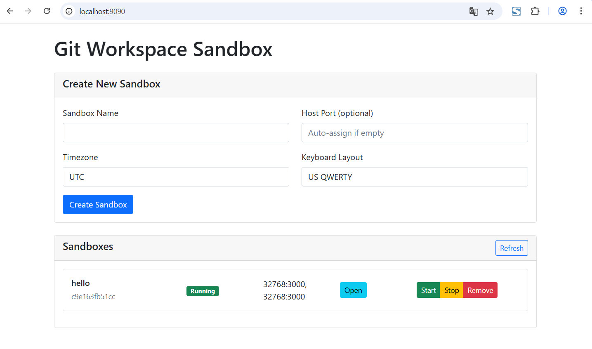

# sandbox

[](https://github.com/repo-scm/sandbox/actions?query=workflow%3Aci)
[](https://goreportcard.com/report/github.com/repo-scm/sandbox)
[](https://github.com/repo-scm/sandbox/blob/main/LICENSE)
[](https://github.com/repo-scm/sandbox/tags)


## Introduction

git workspace sandbox


## Usage

```bash
make build
./bin/sandbox serve --address ":9090"
```


## Screenshot

### Create



### Open


## License

Project License can be found [here](LICENSE).


## Reference

- [docker-webtop](https://github.com/linuxserver/docker-webtop)
